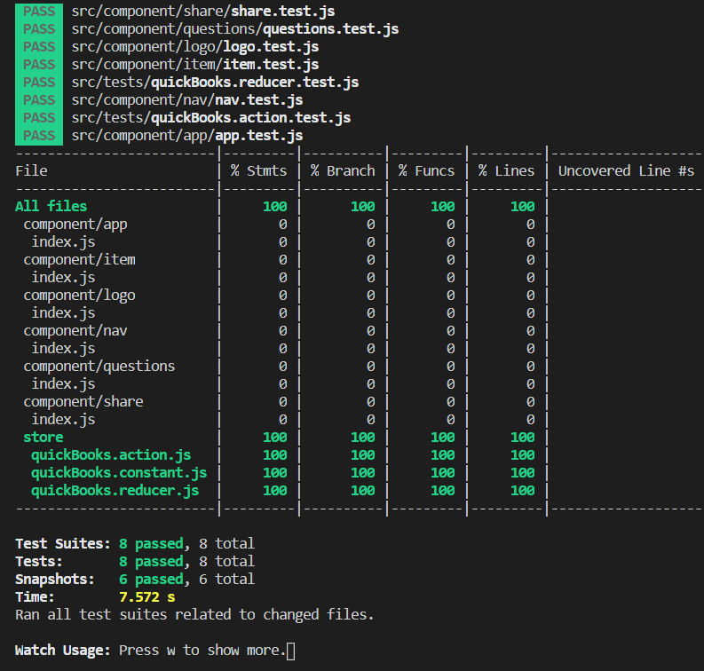

# Getting Started with my **Quick Books Intuit** Project

## Start by running the following command in your terminal In order to install all the dependencies needed :

``` 
yarn
```

### Or

```
npm i
```

## Now the project can be seen in the browser by using one of the two options:

```
yarn start
```

### Or

```
npm start
```

## In order to see the test coverage use the following command:

```
yarn test
```
```
yarn test --coverage
```


## I hope you will like it !
